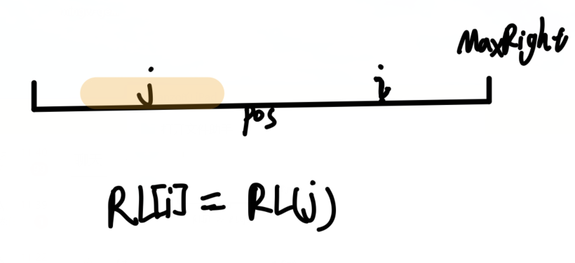
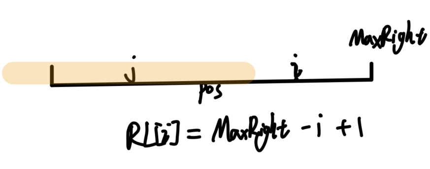
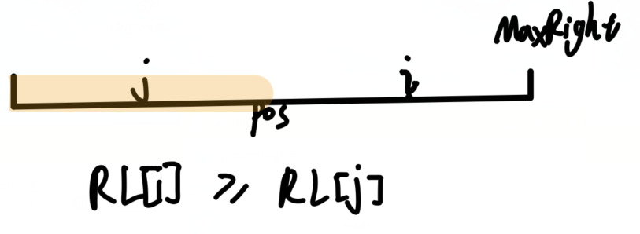
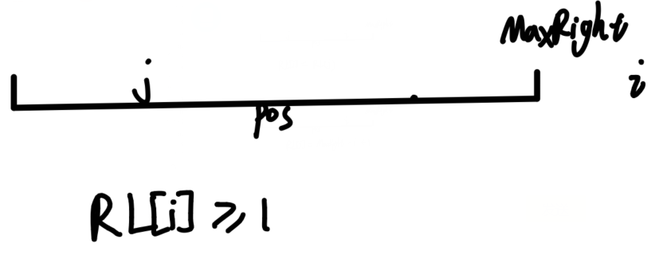

# 字符串专题

#### Manacher
最长回文串的问题
**pos：**表示回文串的中心
**i：**表示当前位置
**RL[i]：**表示i的回文半径
**MaxRight：**表示当回文串的最右端的位置
**Maxlen：**记录最长回文串的长度

- 预处理
	首先对字符串进行处理，在字符串的每个位置加上字符#，例如字符**abba**经过处理得到**#a#a#b#b#**，字符**aba**经过处理得到**#a#b#a#**，这样我们得到的`RL - 1`就是当前位置的回文串的长度
- 分类讨论
	1. 
	2. 
	3. 
	4. 

```c++
int RL[maxn<<1];
int Manacher(string s) {
	cout << s << endl;
	string t;
	for (int i = 0; i < (int)s.size(); ++i) {
		t += '#', t += s[i];
	}
	s = t + '#';
	int len = s.size();
	int MaxRight = 0, pos = 0, Maxlen = 0;
	for (int i = 0; i < len; ++i) {
		if (i <= MaxRight) RL[i] = min(RL[2*pos-i], MaxRight-i-1);
		else RL[i] = 1;
		int l = i - RL[i];
		int r = i + RL[i];
		while (l >= 0 && r < len && s[l] == s[r]) {
			RL[i]++, l--, r++;
		}
		if (RL[i] + i - 1 > MaxRight) {
			MaxRight = RL[i] + i - 1;
			pos = i;
		}
		Maxlen = max(Maxlen, RL[i]);
	}
	return Maxlen - 1;
}
```

#### KMP
字符串匹配问题

