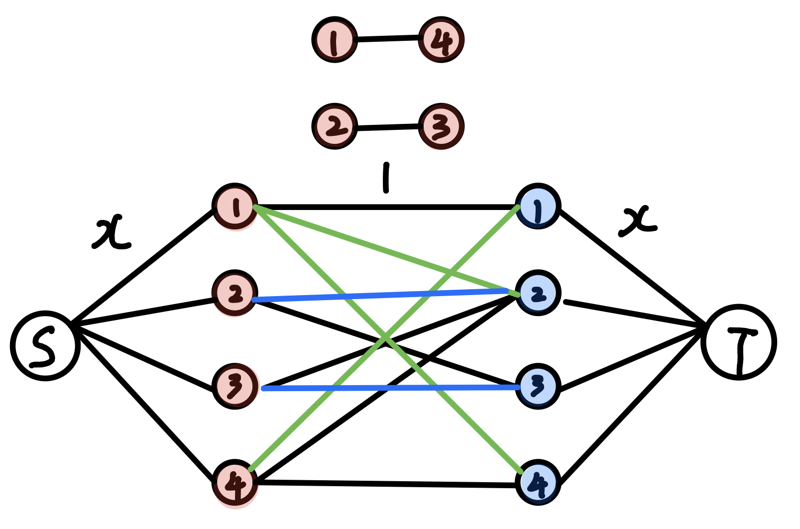
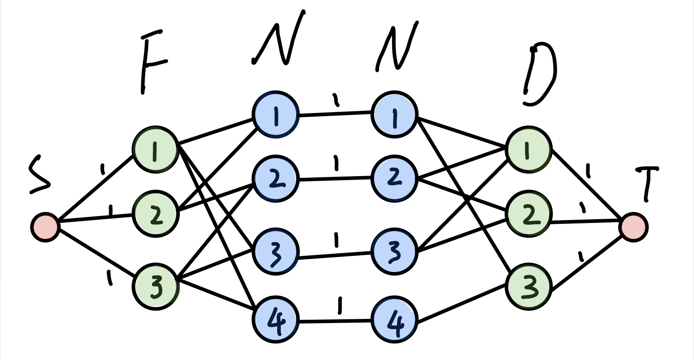
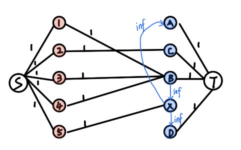
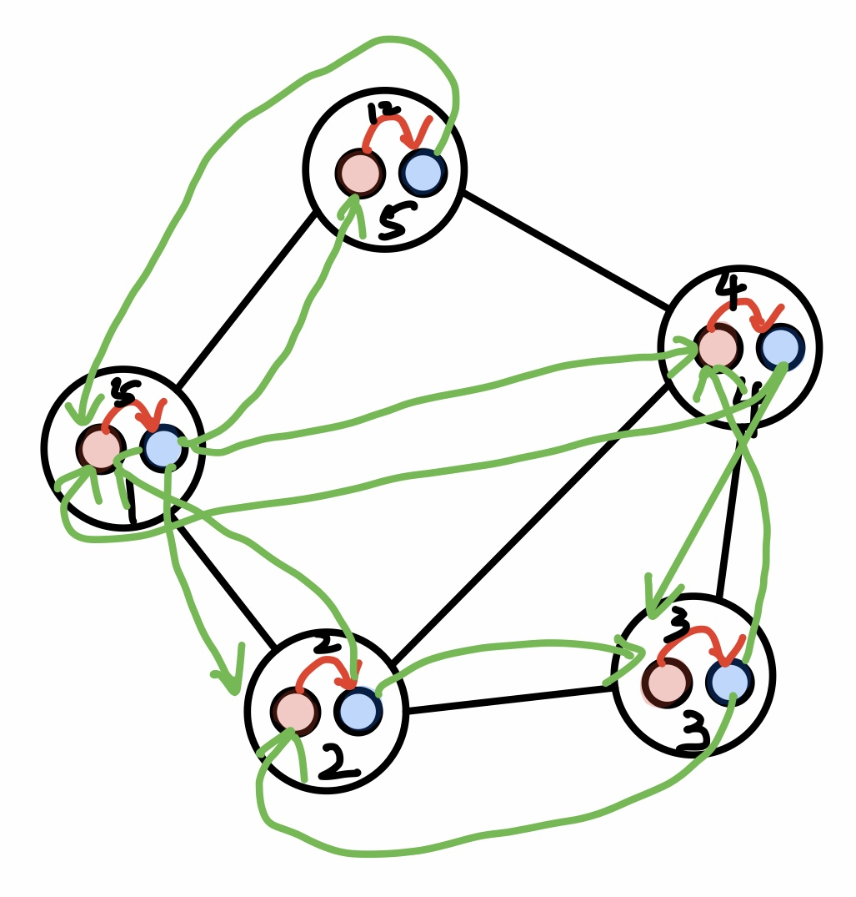

<center><font size="6"> 网络流、费用流 题解</font></center>
### [A - Marriage Match II](#A)
### [B - Dining](#B)
### [C - A Plug for UNIX](#C)
### [D - Going Home](#D)
### [E - Minimum Cost](#E)
### [F - Power Network](#F)
### [G - Food](#G)
### [H - Control](#H)
### [I - Sabotage](#I)

<div STYLE="page-break-after: always;"></div>
<h3 id="A">A - Marriage Match II (HDU - 3081)</h3>
#### 题意

N个男孩和女孩，每个女孩有自己喜欢的对象，女孩可以喜欢朋友的喜欢的男孩，现在有一个游戏，每轮游戏女孩和自己喜欢过的男孩（这个男孩在之前的游戏中没有被选择过）结合在一起，问这种关系能够玩几轮游戏？

#### 思路

- 可以一直跑匹配，把匹配过的边删除接着跑匹配。

- 网络流 + 二分

二分枚举一共能进行的轮数，网络流判断是否可行

假设当前枚举进行x轮游戏

建图：

- 源点到女孩建边，流量=x (限制每个女孩最多可以选择x个男孩)

- 男孩到汇点建边，流量=x (限制每个男孩最多可以被选择x次)

- 女孩到男孩按照喜好建边，流量=1 (表示选择过的男孩不能第二次选择)

  这里需要用到并查集，将女孩之间的朋友关系并到一起

这样跑完最大流之后，如果是满流，证明可以玩x轮游戏，因为每个女孩都能在顺利选择x个男孩，并且这x个男孩不重复。




```cpp
#include <iostream>
#include <stdio.h>
#include <queue>
#include <cstring>
const int maxn = 3e2 + 5;
const int inf = 0x3f3f3f3f;
using namespace std;
struct ac{
	int v, c, nex;
}edge[maxn<<9];
int head[maxn], cnt;
int dis[maxn], s, e;
int curedge[maxn];
int n, m, f;
void addedge(int u, int v, int c) {
	edge[cnt] = {v, c, head[u]};
	head[u] = cnt++;
	edge[cnt] = {u, 0, head[v]};
	head[v] = cnt++;
}
int bfs() {
	memset(dis, 0, sizeof(dis));
	dis[s] = 1;
	queue<int> que;
	que.push(s);
	while (!que.empty()) {
		int u = que.front();
		que.pop();
		for (int i = head[u]; i != -1; i = edge[i].nex) {
			int v = edge[i].v;
			int c = edge[i].c;
			if (c == 0 || dis[v]) continue;
			dis[v] = dis[u] + 1;
			que.push(v);
		}
	}
	return dis[e];
}
int dfs(int u, int flow) {
	if (u == e || flow == 0) return flow;
	for (int &i = curedge[u]; i != -1; i = edge[i].nex) {
		int v = edge[i].v;
		int c = edge[i].c;
		if (c == 0 || dis[v] != dis[u] + 1) continue;
		int tmp = dfs(v, min(flow, c));
		if (tmp > 0) {
			edge[i].c -= tmp;
			edge[i^1].c += tmp;
			return tmp;
		}
	}
	dis[u] = -1;
	return 0;
}
int Dinic() {
	int ans = 0, d;
	while (bfs()) {
		for (int i = 0; i <= e; ++i) curedge[i] = head[i];
		while ((d = dfs(s, inf)) > 0) ans += d;
	}
	return ans;
}
int pre[maxn];
int find(int x) {
	return (x == pre[x]) ? x : pre[x] = find(pre[x]);
}
void join(int x, int y) {
	if (x == y) return;
	if (x > y) swap(x, y);
	pre[y] = x;
	return;  
}
vector<int> g[maxn];
int vis[maxn];
int check(int x) {
	memset(head, -1, sizeof(head));
	cnt = 0;
	for (int i = 1; i <= n; ++i) {
		memset(vis, 0, sizeof(vis));
		for (int j = 0; j < (int)g[i].size(); ++j) {
			int u = g[i][j];
			if (vis[u]) continue;
			// 找girl u的朋友
			for (int k = 1; k <= n; ++k) {
				if (vis[k] || find(u) != find(k)) continue;
				addedge(k, i+n, 1);
				vis[k] = 1;
			}
		}
	}
	for (int i = 1; i <= n; ++i) addedge(s, i, x), addedge(i+n, e, x);
	return Dinic() == x*n;
}
int main () {
	ios::sync_with_stdio(false);
	cin.tie(0), cout.tie(0);
	int T;
	cin >> T;
	while (T--) {
		cin >> n >> m >> f;
		s = 0, e = n * 2 + 1;
		for (int i = 0; i <= n; ++i) g[i].clear();
		for (int i = 0; i <= n; ++i) pre[i] = i;
		
		for (int i = 0; i < m; ++i) {
			int u, v;
			cin >> u >> v;
			g[v].push_back(u);
		}
		for (int i = 0; i < f; ++i) {
			int u, v;
			cin >> u >> v;
			join(find(u), find(v));
		}
		int l = 0, r = n;
		while (l <= r) {
			int mid = (l + r) >> 1;
			if (check(mid)) l = mid + 1;
			else r = mid - 1;
		}
		cout << r << endl;
	}
	return 0;	
}
```
<h3 id="B">B - Dining(POJ-3281)</h3>
#### 题意
每头牛都有各自喜欢的食物和饮料，而每种食物或饮料只能分配给一头牛。最多能有多少头牛可以同时得到喜欢的食物和饮料？
#### 思路
最大流
将牛拆成点，限制牛的流量。保证增光路上对应得是牛喜欢的食物和水


```cpp
#include <iostream>
#include <queue>
#include <cstring>
const int maxn = 4e2 + 5;
const int inf = 0x3f3f3f3f;
using namespace std;
struct ac{
	int v, c, nex;
}edge[maxn << 4];
int head[maxn], curedge[maxn], cnt, s, e;
int dis[maxn];
void init() {
	memset(head, -1, sizeof(head));
	cnt = 0;
}
void addedge(int u, int v, int c) {
	edge[cnt] = {v, c, head[u]};
	head[u] = cnt++;
	edge[cnt] = {u, 0, head[v]};
	head[v] = cnt++;
}
int bfs() {
	memset(dis, 0, sizeof(dis));
	dis[s] = 1;
	queue<int> que;
	que.push(s);
	while (!que.empty()) {
		int u = que.front();
		que.pop();
		for (int i = head[u]; i != -1; i = edge[i].nex) {
			int v = edge[i].v;
			int c = edge[i].c;
			if (dis[v] || c == 0) continue;
			dis[v] = dis[u] + 1;
			que.push(v);
		}
	}
	return dis[e] > 0;
}
int dfs(int u, int flow) {
	if (u == e || flow == 0) return flow;
	for (int &i = curedge[u]; i != -1; i = edge[i].nex) {
		int v = edge[i].v;
		int c = edge[i].c;
		if (dis[v] != dis[u] + 1) continue;
		int tmp = dfs(v, min(flow, c));
		if (tmp > 0) {
			edge[i].c -= tmp;
			edge[i^1].c += tmp;
			return tmp;
		}
	}
	dis[u] = -1;
	return 0;
}
int Dinic() {
	int ans = 0, tmp;
	while (bfs()) {
		for (int i = 0; i <= e; ++i) curedge[i] = head[i];
		while ((tmp = dfs(s, inf)) > 0) ans += tmp;
	}
	return ans;
}
int main () {
    ios::sync_with_stdio(false);
    cin.tie(0), cout.tie(0);
    int n, f, d;
    while (cin >> n >> f >> d) {
    	init();
	    s = 0, e = n*2 + f + d + 1;
	    for (int i = 1; i <= n; ++i) {
	    	int a, b, t;
	    	cin >> a >> b;
	    	for (int j = 1; j <= a; ++j) {
	    		cin >> t;
	    		addedge(t, f+i, 1);
	    	}
	    	for (int j = 1; j <= b; ++j) {
	    		cin >> t;
	    		addedge(f+n+i, n*2+f+t, 1);
	    	}
	    }
	    for (int j = 1; j <= f; ++j) addedge(s, j, 1);
	    for (int j = 1; j <= d; ++j) addedge(n*2+f+j, e, 1);
	    for (int j = 1; j <= n; ++j) addedge(f+j, f+n+j, 1);
	    cout << Dinic() << endl;
    }
    return 0;
}
```

<h3 id="C">C - A Plug for UNIX (POJ-1087)</h3>
#### 题意
一共有N个插座，M个设备，K个转换器，转换器可以无限提供，问最少有多少个设备不能连接电源
#### 思路
最大流
建图：

- 源点到设备流量1
- 插座到汇点流量1
- 转换器之间流量inf



```cpp
#include <iostream>
#include <stdio.h>
#include <queue>
#include <map>
#include <cstring>
const int maxn = 4e2 + 5;
const int inf = 0x3f3f3f3f;
using namespace std;
struct ac{
	int v, c, nex;
}edge[maxn << 7];
int head[maxn], curedge[maxn], cnt, s, e;
int dis[maxn];
int a[maxn][maxn];
void init() {
	memset(head, -1, sizeof(head));
	memset(a, 0, sizeof(a));
	cnt = 0;
}
void addedge(int u, int v, int c) {
	edge[cnt] = {v, c, head[u]};
	head[u] = cnt++;
	edge[cnt] = {u, 0, head[v]};
	head[v] = cnt++;
}
int bfs() {
	memset(dis, 0, sizeof(dis));
	dis[s] = 1;
	queue<int> que;
	que.push(s);
	while (!que.empty()) {
		int u = que.front();
		que.pop();
		for (int i = head[u]; i != -1; i = edge[i].nex) {
			int v = edge[i].v;
			int c = edge[i].c;
			if (dis[v] || c == 0) continue;
			dis[v] = dis[u] + 1;
			que.push(v);
		}
	}
	return dis[e] > 0;
}
int dfs(int u, int flow) {
	if (u == e || flow == 0) return flow;
	for (int &i = curedge[u]; i != -1; i = edge[i].nex) {
		int v = edge[i].v;
		int c = edge[i].c;
		if (dis[v] != dis[u] + 1) continue;
		int tmp = dfs(v, min(flow, c));
		if (tmp > 0) {
			edge[i].c -= tmp;
			edge[i^1].c += tmp;
			return tmp;
		}
	}
	dis[u] = -1;
	return 0;
}
int Dinic() {
	int ans = 0, tmp;
	while (bfs()) {
		for (int i = 0; i <= e; ++i) curedge[i] = head[i];
		while ((tmp = dfs(s, inf)) > 0) ans += tmp;
	}
	return ans;
}
int main () {
    ios::sync_with_stdio(false);
    cin.tie(0), cout.tie(0);
    int n, m, q;
    while (cin >> n) {
    	init();
    	map<string, int> mp;
    	int num = 0;
    	vector<string> have(maxn), device(maxn);
    	for (int i = 0; i < n; ++i) {
    		cin >> have[i];
    		if (mp[have[i]] == 0) mp[have[i]] = ++num;
    	}
    	cin >> m;
    	for (int j = 0; j < m; ++j) {
    		cin >> device[j] >> device[j];
    		if (mp[device[j]] == 0) mp[device[j]] = ++num;
    	}
    	cin >> q;
    	for (int i = 0; i < q; ++i) {
    		string l, r;
    		cin >> l >> r;
    		if (mp[l] == 0) mp[l] = ++num;
    		if (mp[r] == 0) mp[r] = ++num;
    		addedge(mp[l], mp[r], inf);
    	}
    	s = 0, e = num + 1;
    	for (int i = 0; i < m; ++i) addedge(s, mp[device[i]], 1);
    	for (int i = 0; i < n; ++i) addedge(mp[have[i]], e, 1);
    	cout << m - Dinic() << endl;
    }
    return 0;
}
```

<h3 id="D">D - Going Home(POJ-2195)</h3>
#### 题意
n个人要进到房子里面，每个人的花费是他移动的距离。求n个人进房子的最小花费
#### 思路
费用流

```cpp
#include <iostream>
#include <queue>
#include <cmath>
#include <cstring>
const int maxn = 1e4 + 5;
const int inf = 0x3f3f3f3f;
using namespace std;
int path[maxn], dis[maxn], head[maxn], vis[maxn];
int cnt, s, e;
void init() {
	memset(head, -1, sizeof(head));
	cnt = 0;
}
struct ac{
	int v, c, cost, nex;
}edge[maxn << 11];
void addedge(int u, int v, int c, int cost) {
	edge[cnt] = {v, c, cost, head[u]};
	head[u] = cnt++;
	edge[cnt] = {u, 0, -cost, head[v]};
	head[v] = cnt++;
}
int spfa(int s, int e) {
	memset(vis, 0, sizeof(vis));
	memset(dis, inf, sizeof(dis));
	memset(path, -1, sizeof(path));
	queue<int> que;
	que.push(s);
	dis[s] = 0;
	vis[s] = 1;
	while (!que.empty()) {
		int u = que.front();
		que.pop();
		vis[u] = 0;
		for (int i = head[u]; i != -1; i = edge[i].nex) {
			int v = edge[i].v;
			int c = edge[i].c;
			int cost = edge[i].cost;
			if (dis[v] > dis[u] + cost && c > 0) {
				dis[v] = dis[u] + cost;
				path[v] = i;
				if (vis[v]) continue;
				vis[v] = 1;
				que.push(v);
			}
		}
	}
	return dis[e] != inf;
}
int MincostMaxflow(int s, int e, int &cost) {
	int maxflow = 0;
	while (spfa(s, e)) {
		int flow = inf;
		for (int i = path[e]; i != -1; i = path[edge[i^1].v]) {
			flow = min(flow, edge[i].c);
		}
		for (int i = path[e]; i != -1; i = path[edge[i^1].v]) {
			edge[i].c -= flow;
			edge[i^1].c += flow;
			cost += flow * edge[i].cost;
		}
		maxflow += flow;
	}
	return maxflow;
}
int main () {
	ios::sync_with_stdio(false);
	cin.tie(0), cout.tie(0);
	int n, m; char c;
	while (cin >> n >> m, n) {
		init();
		vector<pair<int,int> > H, M;
		for(int i = 0; i < n; ++i) {
			for (int j = 0; j < m; ++j) {
				cin >> c;
				if (c == 'm') M.push_back(make_pair(i, j));
				if (c == 'H') H.push_back(make_pair(i, j)); 
			}
		}
		int cntH = H.size();
		int cntM = M.size();
		s = 0, e = cntH + cntM + 1;
		for (int i = 0; i < cntM; ++i) {
			addedge(s, i+1, 1, 0);
		}
		for (int i = 0; i < cntH; ++i) {
			addedge(cntM+i+1, e, 1, 0);
		}
		for (int i = 0; i < cntH; ++i) {
			for (int j = 0; j < cntM; ++j) {
				int cost = fabs(H[i].first - M[j].first) + fabs(H[i].second - M[j].second);
				addedge(j+1, cntM+i+1, 1, cost);
			}
		}
		int cost = 0;
		MincostMaxflow(s, e, cost);
		cout << cost << endl;
	}
	return 0;	
}
```

<h3 id="E">E - Minimum Cost(POJ-2516)</h3>
#### 题意
N个商店每个商店需要K个货物，需求量各不相同，M个供应商每个供应商都提供K个货物，供应量各不相同，货物不同的供应商提供的价格不同，求最小的花费满足N个商店的需求
#### 思路
费用流
每种货物互相不影响，每种货物可以单独考虑，简化建图
建图：
- 源点到供应商 流量为存货量，费用为0
- 供应商到商店 流量为inf，费用为对应的单价
- 商店到汇点 流量为需求量，费用为0


```cpp
#include <iostream>
#include <stdio.h>
#include <cstring>
#include <queue>
const int maxn = 1e2 + 5;
const int inf = 0x3f3f3f3f;
using namespace std;
struct ac{
	int v, c, cost, nex;
}edge[maxn << 5];
int dis[maxn], vis[maxn];
int head[maxn], cnt, path[maxn];
void addedge(int u, int v, int c, int cost) {
	edge[cnt] = {v, c, cost, head[u]};
	head[u] = cnt++;
	edge[cnt] = {u, 0, -cost, head[v]};
	head[v] = cnt++;	
}
void init() {
	memset(head, -1, sizeof(head));
	cnt = 0;
}
int spfa(int s, int e) {
	memset(vis, 0, sizeof(vis));
	memset(dis, inf, sizeof(dis));
	memset(path, -1, sizeof(path));
	dis[s] = 0;
	vis[s] = 1;
	queue<int> que;
	que.push(s);
	while (!que.empty()) {
		int u = que.front();
		que.pop();
		vis[u] = 0;
		for (int i = head[u]; i != -1; i = edge[i].nex) {
			int v = edge[i].v;
			int c = edge[i].c;
			int cost = edge[i].cost;
			if (c == 0 || dis[v] <= dis[u] + cost) continue;
			path[v] = i;
			dis[v] = dis[u] + cost;
			if (vis[v]) continue;
			vis[v] = 1;
			que.push(v);
		}
	}
	return dis[e] != inf;
}
int MCMF(int s, int e, int &cost) {
	int maxflow = 0;
	while (spfa(s, e)) {
		int flow = inf;
		for (int i = path[e]; i != -1; i = path[edge[i^1].v]) {
			flow = min(flow, edge[i].c);
		}
		for (int i = path[e]; i != -1; i = path[edge[i^1].v]) {
			edge[i].c -= flow;
			edge[i^1].c += flow;
			cost += flow * edge[i].cost;
		}
		maxflow += flow;
	}
	return maxflow;
}
int supply[55][55];
int need[55][55];
int price[55][55][55];
int main() {
	ios::sync_with_stdio(false);
	cin.tie(0), cout.tie(0);
	int n, m, k;
	while (cin >> n >> m >> k, n) {
		for (int i = 1; i <= n; ++i) {
			for (int j = 1; j <= k; ++j) {
				cin >> need[i][j]; // 商店i需要货物j
			}
		}
		for (int i = 1; i <= m; ++i) {
			for (int j = 1; j <= k; ++j) {
				cin >> supply[i][j]; // 供应商i提供货物j
			}
		}
		for (int q = 1; q <= k; ++q) {
			for (int i = 1; i <= n; ++i) {
				for (int j = 1; j <= m; ++j) {
					cin >> price[q][j][i]; // 货物q从j到i的价格
				}
			}
		}
		// 分开对每个货物求费用流
		int s = 0, e = m + n + 1;
		int ans = 0;
		for (int q = 1; q <= k; ++q) {
			int sum = 0;
			for (int i = 1; i <= n; ++i) {
				sum += need[i][q];
			}
			init();
			for (int i = 1; i <= m; ++i) addedge(s, i, supply[i][q], 0);
			for (int i = 1; i <= n; ++i) addedge(m+i, e, need[i][q], 0);
			for (int i = 1; i <= m; ++i) {
				for (int j = 1; j <= n; ++j) {
					addedge(i, m+j, inf, price[q][i][j]);
				}
			}
			int maxflow = MCMF(s, e, ans);
			if (maxflow != sum) {
				ans = -1;
				break;
			}
		}
		cout << ans << endl;
	}
	return 0;
}
```

<h3 id="F">F - Power Network(POJ - 1459)</h3>
#### 题意
np个发电站供电，nc个用户消耗，m条线路，求最大的消耗量
#### 思路
最大流
```cpp
#include <iostream>
#include <stdio.h>
#include <queue>
#include <cstring>
const int maxn = 2e2 + 5;
const int inf = 0x3f3f3f3f;
using namespace std;
struct ac{
	int v, c, nex;
}edge[maxn << 8];
int head[maxn], cnt;
int dis[maxn], s, e;
int curedge[maxn];
void addedge(int u, int v, int c) {
	edge[cnt] = {v, c, head[u]};
	head[u] = cnt++;
	edge[cnt] = {u, 0, head[v]};
	head[v] = cnt++;
}
int bfs() {
	memset(dis, 0, sizeof(dis));
	dis[s] = 1;
	queue<int> que;
	que.push(s);
	while (!que.empty()) {
		int u = que.front();
		que.pop();
		for (int i = head[u]; i != -1; i = edge[i].nex) {
			int v = edge[i].v;
			int c = edge[i].c;
			if (c == 0 || dis[v]) continue;
			dis[v] = dis[u] + 1;
			que.push(v);
		}
	}
	return dis[e];
}
int dfs(int u, int flow) {
	if (u == e || flow == 0) return flow;
	for (int &i = curedge[u]; i != -1; i = edge[i].nex) {
		int v = edge[i].v;
		int c = edge[i].c;
		if (c == 0 || dis[v] != dis[u] + 1) continue;
		int tmp = dfs(v, min(flow, c));
		if (tmp > 0) {
			edge[i].c -= tmp;
			edge[i^1].c += tmp;
			return tmp;
		}
	}
	dis[u] = -1;
	return 0;
}
int Dinic() {
	int ans = 0, d;
	while (bfs()) {
		for (int i = 0; i <= e; ++i) curedge[i] = head[i];
		while ((d = dfs(s, inf)) > 0) ans += d;
	}
	return ans;
}
int main () {
	ios::sync_with_stdio(false);
	cin.tie(0), cout.tie(0);
	int n, np, nc, m;
	while (scanf("%d %d %d %d", &n, &np, &nc, &m) != EOF) {
		s = n, e = n + 1;
		memset(head, -1, sizeof(head));
		cnt = 0;
		int u, v, c;
		for (int i = 0; i < m; ++i) {
			scanf(" (%d,%d)%d", &u, &v, &c);
			addedge(u, v, c);
		}
		for (int i = 0; i < np; ++i) {
			scanf(" (%d)%d", &v, &c);
			addedge(s, v, c);
		}
		for (int i = 0; i < nc; ++i) {
			scanf(" (%d)%d", &v, &c);
			addedge(v, e, c);
		}
		printf("%d\n", Dinic());
	}
	return 0;	
}
```

<h3 id="G">G - Food(HDU-4292)</h3>
#### 题意

N个人分别有自己喜欢的食物和饮料，实物和饮料有一定的数量，最多能满足多少人的需求？

#### 思路

把人拆点，限制人的流量

建图：

- 源点到食物按库存建边
- 食物到人按需求建边
- 人到饮料按需求建边
- 饮料到汇点按库存建边

```cpp
#include <iostream>
#include <queue>
#include <cmath>
#include <cstring>
const int maxn = 8e2 + 5;
const int inf = 0x3f3f3f3f;
using namespace std;

int head[maxn], cnt;
int s, e;
int curedge[maxn], dis[maxn];
struct ac{
	int v, c, nex;
}edge[maxn << 8];
void addedge(int u, int v, int c) {
	edge[cnt] = {v, c, head[u]};
	head[u] = cnt++;
	edge[cnt] = {u, 0, head[v]};
	head[v] = cnt++;
}
int bfs() {
	memset(dis, 0, sizeof(dis));
	dis[s] = 1;
	queue<int> que;
	que.push(s);
	while (!que.empty()) {
		int u = que.front();
		que.pop();
		for (int i = head[u]; i != -1; i = edge[i].nex) {
			int v = edge[i].v;
			int c = edge[i].c;
			if (c == 0 || dis[v]) continue;
			dis[v] = dis[u] + 1;
			que.push(v);
		}
	}
	return dis[e];
}
int dfs(int u, int flow) {
	if (u == e || flow == 0) return flow;
	for (int &i = curedge[u]; i != -1; i = edge[i].nex) {
		int v = edge[i].v;
		int c = edge[i].c;
		if (dis[v] != dis[u] + 1 || c == 0) continue;
		int tmp = dfs(v, min(flow, c));
		if (tmp > 0) {
			edge[i].c -= tmp;
			edge[i^1].c += tmp;
			return tmp;
		}
	}
	dis[u] = -1;
	return 0;
}
int Dinic() {
	int ans = 0, d;
	while (bfs()) {
		for (int i = 0; i <= e; ++i) curedge[i] = head[i];
		while ((d = dfs(s, inf)) > 0) ans += d;
	}
	return ans;
}
int main () {
	ios::sync_with_stdio(false);
	cin.tie(0), cout.tie(0);
	int n, f, d, t;
	while (cin >> n >> f >> d) {
		memset(head, -1, sizeof(head));
		cnt = 0;
		s = 0, e = f+n+n+d+1;
		string str;
		for (int i = 1; i <= f; ++i) {
			cin >> t;
			addedge(s, i, t);
		}
		for (int i = 1; i <= d; ++i) {
			cin >> t;
			addedge(f+n+n+i, e, t);
		}
		for (int i = 1; i <= n; ++i) {
			cin >> str;
			for (int j = 0; j < f; ++j) {
				if (str[j] == 'N') continue;
				addedge(j+1, f+i, 1);
			}
		}
		for (int i = 1; i <= n; ++i) {
			cin >> str;
			for (int j = 0; j < d; ++j) {
				if (str[j] == 'N') continue;
				addedge(f+n+i, f+n+n+j+1, 1);
			}
		}
		for (int i = 1; i <= n; ++i) addedge(f+i, f+n+i, 1);
		cout << Dinic() << endl;
	}
	return 0;	
}
```

<h3 id="H">H - Control(HDU-4289)</h3>
#### 题意
N个城市，每个城市建立SA有一定的花费，从出发点到目的点，在保证抓获劫匪的前提花费最小
#### 思路
最小割 = 最大流
保证抓获所有的劫匪，等价于源点到汇点不连通



```cpp
#include <iostream>
#include <queue>
#include <cmath>
#include <cstring>
const int maxn = 4e2 + 5;
const int inf = 0x3f3f3f3f;
using namespace std;

int head[maxn], cnt;
int s, e;
int curedge[maxn], dis[maxn];
int n, m, val;
struct ac{
	int v, c, nex;
}edge[maxn << 8];
void addedge(int u, int v, int c) {
	edge[cnt] = {v, c, head[u]};
	head[u] = cnt++;
	edge[cnt] = {u, 0, head[v]};
	head[v] = cnt++;
}
int bfs() {
	memset(dis, 0, sizeof(dis));
	dis[s] = 1;
	queue<int> que;
	que.push(s);
	while (!que.empty()) {
		int u = que.front();
		que.pop();
		for (int i = head[u]; i != -1; i = edge[i].nex) {
			int v = edge[i].v;
			int c = edge[i].c;
			if (c == 0 || dis[v]) continue;
			dis[v] = dis[u] + 1;
			que.push(v);
		}
	}
	return dis[e];
}
int dfs(int u, int flow) {
	if (u == e || flow == 0) return flow;
	for (int &i = curedge[u]; i != -1; i = edge[i].nex) {
		int v = edge[i].v;
		int c = edge[i].c;
		if (dis[v] != dis[u] + 1 || c == 0) continue;
		int tmp = dfs(v, min(flow, c));
		if (tmp > 0) {
			edge[i].c -= tmp;
			edge[i^1].c += tmp;
			return tmp;
		}
	}
	dis[u] = -1;
	return 0;
}
int Dinic() {
	int ans = 0, d;
	while (bfs()) {
		for (int i = 0; i <= n*2; ++i) curedge[i] = head[i];
		while ((d = dfs(s, inf)) > 0) ans += d;
	}
	return ans;
}
int L(int x) {return (x - 1) * 2;}
int R(int x) {return L(x) + 1;}
int main () {
	ios::sync_with_stdio(false);
	cin.tie(0), cout.tie(0);
	while (cin >> n >> m) {
		memset(head, -1, sizeof(head));
		cnt = 0;
		cin >> s >> e;
		s = L(s);
		e = R(e);
		for (int i = 1; i <= n; ++i) {
			cin >> val;
			addedge(L(i), R(i), val);
		}
		for (int i = 1; i <= m; ++i) {
			int u, v;
			cin >> u >> v;
			addedge(R(u), L(v), inf);
			addedge(R(v), L(u), inf);
		}
		cout << Dinic() << endl;
	}
	return 0;	
}
```
<h3 id="I">I - Sabotage(UVA-10480 )</h3>
#### 题意

在花费最小的情况下将点1和点2分开

#### 思路

最小割 = 最大流

```cpp
#include <iostream>
#include <stdio.h>
#include <queue>
#include <cstring>
const int maxn = 1e2 + 5;
const int inf = 0x3f3f3f3f;
using namespace std;
struct ac{
	int v, c, nex;
}edge[maxn<<5];
int n, m;
int head[maxn], cnt;
int dis[maxn], s, e;
int curedge[maxn];
void addedge(int u, int v, int c) {
	edge[cnt] = {v, c, head[u]};
	head[u] = cnt++;
	edge[cnt] = {u, c, head[v]};
	head[v] = cnt++;
}
int bfs() {
	memset(dis, 0, sizeof(dis));
	dis[s] = 1;
	queue<int> que;
	que.push(s);
	while (!que.empty()) {
		int u = que.front();
		que.pop();
		for (int i = head[u]; i != -1; i = edge[i].nex) {
			int v = edge[i].v;
			int c = edge[i].c;
			if (c == 0 || dis[v]) continue;
			dis[v] = dis[u] + 1;
			que.push(v);
		}
	}
	return dis[e];
}
int dfs(int u, int flow) {
	if (u == e || flow == 0) return flow;
	for (int &i = curedge[u]; i != -1; i = edge[i].nex) {
		int v = edge[i].v;
		int c = edge[i].c;
		if (c == 0 || dis[v] != dis[u] + 1) continue;
		int tmp = dfs(v, min(flow, c));
		if (tmp > 0) {
			edge[i].c -= tmp;
			edge[i^1].c += tmp;
			return tmp;
		}
	}
	dis[u] = -1;
	return 0;
}
int Dinic() {
	int ans = 0, d;
	while (bfs()) {
		for (int i = 0; i <= n; ++i) curedge[i] = head[i];
		while ((d = dfs(s, inf)) > 0) ans += d;
	}
	return ans;
}
int main () {
	ios::sync_with_stdio(false);
	cin.tie(0), cout.tie(0);
	while (cin >> n >> m, n&&m) {
		memset(head, -1, sizeof(head));
		cnt = 0;
		s = 1, e = 2;
		vector<pair<int,int> > edges(m);
		for (int i = 0; i < m; ++i) {
			int u, v, c;
			cin >> u >> v >> c;
			edges[i] = make_pair(u, v);
			addedge(u, v, c);
			addedge(v, u, c);
		}
		Dinic();	
		for (auto it : edges) {
			int u = it.first;
			int v = it.second;
			if ((dis[u] && !dis[v]) || (!dis[u] && dis[v])) {
				cout << u << " " << v << endl;
			}
		}
		cout << endl;
	}
	return 0;	
}
```