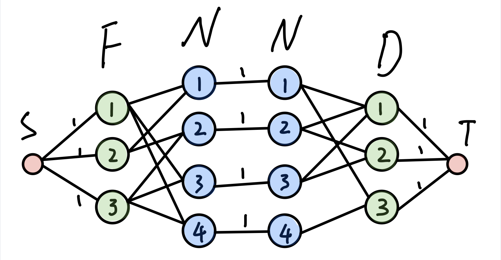

<h3 id="B">B - Dining(POJ-3281)</h3>
#### 题意
每头牛都有各自喜欢的食物和饮料，而每种食物或饮料只能分配给一头牛。最多能有多少头牛可以同时得到喜欢的食物和饮料？
#### 思路
最大流
将牛拆成点，限制牛的流量。保证增光路上对应得是牛喜欢的食物和水


```cpp
#include <iostream>
#include <cstring>
#include <queue>
#include <cmath>
const int maxn = 4e2 + 5;
const int inf = 0x3f3f3f3f;
using namespace std;

struct ac{
    int v, c, nex;
}edge[maxn << 7];
int s, e;
int head[maxn], dis[maxn], curedge[maxn], cnt;
void init() {
    cnt = 0;
    memset(head, -1, sizeof(head));
}
void addedge(int u, int v, int c) {
	// 正向建边
    edge[cnt] = {v, c, head[u]};
    head[u] = cnt++;
    // 反向建边, 流量为0
    edge[cnt] = {u, 0, head[v]};
    head[v] = cnt++;
}
bool bfs() {
    queue<int> que;
    que.push(s);
    memset(dis, 0, sizeof(dis)); // 对图进行分层
    dis[s] = 1;
    while (!que.empty()) {
        int u = que.front();
        que.pop();
        for (int i = head[u]; i != -1; i = edge[i].nex) {
        	int v = edge[i].v;
        	int c = edge[i].c;
        	// 如果节点v已经分过层或者u->v流量为0, continue
            if (dis[v] || c == 0) continue;
            dis[v] = dis[u] + 1; // 对v进行标记并加入队列
            que.push(v);
        }
    }
    return dis[e] > 0;  // 判断是否存在增广路，s是否能到达e
}

int dfs(int u, int flow) { // 增广路走到u点的最小流量为flow
    if (u == e || flow == 0) return flow;
    // 遍历u的所有出边
    for (int &i = curedge[u]; i != -1; i = edge[i].nex) { // 当前弧优化
    	int v = edge[i].v;
    	int c = edge[i].c;
    	// 判断能否u->v增广
        if (dis[v] != dis[u] + 1 || c == 0) continue;
        int d = dfs(v, min(flow, c));
        if (d > 0) { // 找到一条增广路，修改增广路上的正反向边
            edge[i].c -= d;
            edge[i^1].c += d;
            return d;
        }            
    }
    dis[u] = -1; // // 炸点优化
    return 0;
}
int Dinic() {
    int sum = 0, d;
    while (bfs()) { // 判读是否存在增广路
        for (int i = 0; i <= e; ++i) curedge[i] = head[i]; // copy head数组，在dfs中可以直接得到下一条没有被增广过的边
        while ((d = dfs(s, inf)) > 0) sum += d; // 多次dfs找增广路
    }
    return sum;
}

int main() {
	ios::sync_with_stdio(false);
	cin.tie(0), cout.tie(0);
	int N, F, D;
	cin >> N >> F >> D;
	s = 0, e = N + N + F + D + 1;
	init();
	for (int i = 1; i <= N; ++i) {
		int f, d, t;
		cin >> f >> d;
		for (int j = 0; j < f; ++j) {
			cin >> t;
			addedge(t, i+F, inf);
		}
		for (int j = 0; j < d; ++j) {
			cin >> t;
			addedge(i+F+N, t+F+N+N, inf);
		}
	}
	for (int i = 1; i <= N; ++i) {
		addedge(i+F, i+F+N, 1);
	}
	for (int i = 1; i <= F; ++i) {
		addedge(s, i, 1);
	}
	for (int i = 1; i <= D; ++i) {
		addedge(F+N+N+i, e, 1);
	}
	cout << Dinic() << endl;
	return 0;
}
```

<h3 id="D">D - Going Home(POJ-2195)</h3>
#### 题意
n个人要进到房子里面，每个人的花费是他移动的距离。求n个人进房子的最小花费
#### 思路
费用流

```cpp
#include <iostream>
#include <cstring>
#include <stdio.h>
#include <queue>
#include <cmath>
const int maxn = 2e2 + 5;
const int inf = 0x3f3f3f3f;
using namespace std;

int path[maxn], dis[maxn], head[maxn], vis[maxn], cnt;
void init() {
	cnt = 0;
	memset(head, -1, sizeof(head));
}
struct ac{
	int v, c, cost, nex;
}edge[maxn << 7];

void addedge(int u, int v, int c, int cost) {
	// 正向建边
	edge[cnt] = {v, c, cost, head[u]};
	head[u] = cnt++;
	// 反向建边
	edge[cnt] = {u, 0, -cost, head[v]};
	head[v] = cnt++;
}
int spfa(int s, int e) {
	memset(vis, 0, sizeof(vis));
	memset(dis, inf, sizeof(dis)); // 记录从s点出发到每个点的费用和最小值
	memset(path, -1, sizeof(path)); // 记录更新当前点的边在edge中的下标
	queue<int> que;
	que.push(s);
	dis[s] = 0;
	vis[s] = 1;
	while (!que.empty()) {
		int u = que.front();
		que.pop();
		vis[u] = 0;
		// 遍历u的所有出边
		for (int i = head[u]; i != -1; i = edge[i].nex) {
			int v = edge[i].v;
			int c = edge[i].c;
			int cost = edge[i].cost;
			// 判断是否更新v点
			if (dis[v] > dis[u] + cost && c > 0) {
				dis[v] = dis[u] + cost; // 更新最小费用
				path[v] = i;
				if (vis[v]) continue;
				vis[v] = 1;
				que.push(v);
			}
		}
	}
	return dis[e] != inf; // 判断s能否到达e
}
int MincostMaxflow(int s, int e, int &cost) {
	int maxflow = 0;
	while (spfa(s, e)) { // 搜先spfa看是否存在增广路，如果存在求一条费用和最小的一条
		int flow = inf; 
		// 遍历增广路上的边，取最小的流量flow
		// path存的是那条边更新到这个点, i = 这个点在edge中的下标
		// edge[i^1].v 通过反向边得到前驱节点
		for (int i = path[e]; i != -1; i = path[edge[i^1].v]) {
			flow = min(flow, edge[i].c); // 取最小的流量
		}
		// 得到最小流量flow之后，更改正反向的流量
		for (int i = path[e]; i != -1; i = path[edge[i^1].v]) {
			edge[i].c -= flow;
			edge[i^1].c += flow;
			cost += flow * edge[i].cost;
		}
		maxflow += flow;
	}
	return maxflow; // 返回最大流
}

int main() {
	ios::sync_with_stdio(false);
	cin.tie(0), cout.tie(0);
	//freopen("in.txt", "r", stdin);
	int n, m;
	while (cin >> n >> m, n&&m) {
		init();
		vector< pair<int,int> > H, M;
		char c;
		for (int i = 0; i < n; ++i) {
			for (int j = 0; j < m; ++j) {
				cin >> c;
				if (c == 'H') H.push_back(make_pair(i, j));
				if (c == 'm') M.push_back(make_pair(i, j));	
			}
		}
		int lenH = H.size();
		int lenM = M.size();
		int s = 0, e = lenH + lenM + 1;
		for (int i = 0; i < lenM; ++i) {
			for (int j = 0; j < lenH; ++j) {
				int cost = fabs(M[i].first - H[j].first) + fabs(M[i].second - H[j].second);
				addedge(i+1, j+1+lenM, 1, cost);
			}
		}
		for (int i = 0; i < lenM; ++i) {
			addedge(s, i+1, 1, 0);
		}
		for (int i = 0; i < lenH; ++i) {
			addedge(lenM+i+1, e, 1, 0);
		}
		int cost = 0;
		MincostMaxflow(s, e, cost);
		cout << cost << endl;
		 
	}
	
	return 0;
}
```
